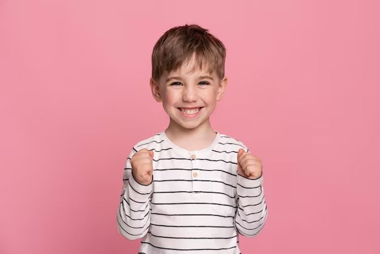

Prompt para gerar a descrição da foto:
> analise o olhar, a expressão facial, postura, atitude, sentimento da criança na foto. Dê a resposta em formato de lista enumerado com no máximo 10 itens.
 

---

## Análise da Criança na Foto:
1.	Olhar Direto: A criança está olhando diretamente para a câmera, o que sugere um estado de alerta, engajamento e conexão com o observador.
2.	Sorriso Largo e Genuíno: O sorriso da criança é largo, com dentes à mostra e rugas ao redor dos olhos, o que indica felicidade genuína e alegria.
3.	Olhos Brilhantes: Os olhos da criança parecem brilhantes e vivos, o que reflete entusiasmo e energia positiva.
4.	Sobrancelhas Relaxadas: As sobrancelhas estão relaxadas e em sua posição natural, sugerindo que a criança está à vontade e não sente tensão ou preocupação.
5.	Postura Aberta: A criança está em pé com o corpo ereto e os braços ligeiramente afastados do corpo, o que demonstra confiança e abertura.
6.	Punhos Cerrados: Os punhos cerrados podem indicar um sentimento de realização, vitória ou determinação, como se a criança estivesse comemorando um sucesso.
7.	Atitude Positiva: A expressão geral da criança transmite uma atitude positiva, otimista e alegre.
8.	Sentimento de Alegria: A combinação de todos os elementos visuais sugere que a criança está experimentando um forte sentimento de alegria e felicidade.
9.	Energia Elevada: A postura e expressão facial indicam que a criança está com um nível elevado de energia e entusiasmo.
10.	Conexão com o Observador: O olhar direto e o sorriso aberto demonstram que a criança está se conectando com o observador e compartilhando sua alegria.
